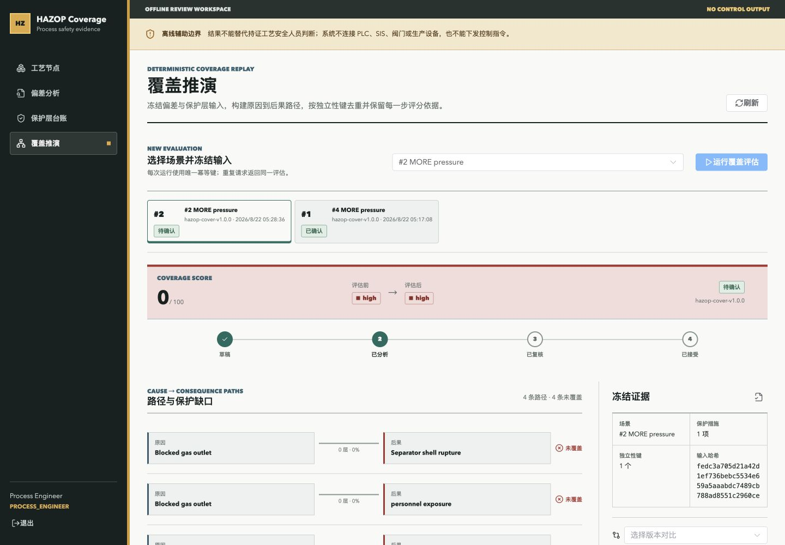
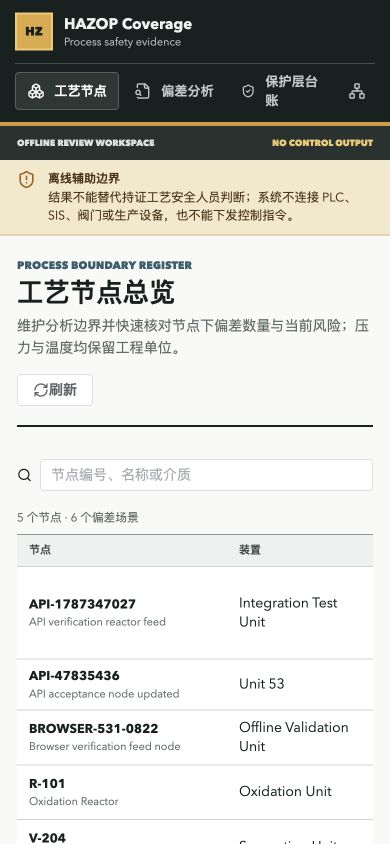

# gb-531 执行验证记录

## 基本信息

| 项目 | 实测值 |
| --- | --- |
| 项目编号 | `gb-531` |
| 项目名称 | `hazop-safeguard-coverage` |
| 验证时间 | 2026-08-22 05:15 至 05:34 CST (`+0800`) |
| 实现提交 | `5fe2595424e7ad6c18302925e7a47f7eed24c116` |
| Go | `go1.25.1 darwin/arm64`，模块声明兼容 Go 1.22 |
| Node.js / npm | `v24.16.0` / `10.2.4` |
| Docker Compose | `v5.1.2` |
| Web 端口 | `18531` |
| Backend 端口 | `19531`，容器内 `8080` |
| PostgreSQL 端口 | `57531`，容器内 `5432` |
| runtime smoke 端口 | `20531` |

本记录是本项目唯一的执行证据文档。README 只描述使用方式，不承载验证结论。

## 规模实测

执行：

```bash

```

结果：`4150` 行 Go 功能代码、`42` 个功能 `.go` 文件，脚本判定符合 `2500-4200` 行和 `24-42` 文件约束，并识别到 `frontend/`。统计不包含 `_test.go`、生成代码和 vendor。

## 构建与测试

| 范围 | 命令 | 实际结果 | 结论 |
| --- | --- | --- | --- |
| Go workspace | `go work sync` | 退出码 0 | 通过 |
| 根目录构建 | `go build ./backend/...` | 退出码 0 | 通过 |
| 根目录静态检查 | `go vet ./backend/...` | 退出码 0 | 通过 |
| 根目录测试 | `go test ./backend/...` | algorithm、constants、service 通过，其余包无测试文件 | 通过 |
| backend 构建 | `cd backend && go build ./...` | 退出码 0 | 通过 |
| backend 静态检查 | `cd backend && go vet ./...` | 退出码 0 | 通过 |
| backend 测试 | `cd backend && go test ./...` | algorithm、constants、service 通过 | 通过 |
| backend 竞态检查 | `cd backend && go test -race ./...` | 全部包通过 | 通过 |
| 前端干净安装 | `npm --prefix frontend ci` | 安装 216 个包 | 通过 |
| 前端单测 | `npm --prefix frontend test` | 2 个测试文件、4 条测试全部通过 | 通过 |
| 前端类型检查 | `npm --prefix frontend run typecheck` | `vue-tsc --noEmit` 退出码 0 | 通过 |
| 前端生产构建 | `npm --prefix frontend run build` | Vite 8.2.2 转换 3191 个模块并完成产物构建 | 通过 |
| 依赖审计 | `npm --prefix frontend audit --audit-level=low --registry=https://registry.npmjs.org` | `found 0 vulnerabilities` | 通过 |
| Compose 配置 | `docker compose config --quiet` | 退出码 0，无废弃 `version` 警告 | 通过 |
| 源码约束扫描 | 检查 TODO/FIXME/XXX、禁止命名测试、答案及 BUG_REPRO 产物 | 未发现匹配项 | 通过 |

默认 npm 镜像 `npmmirror.com` 未实现 audit endpoint，因此安全审计显式切换 npm 官方端点重跑；最终真实结果为 0 漏洞。

## Runtime Smoke

执行：

```bash

```

脚本按 `runtime_smoke.json` 在 `backend/` 执行 `go run ./cmd/server`，使用 SQLite 内存数据库和端口 `20531`。`http://127.0.0.1:20531/healthz` 实际返回 HTTP 200，脚本输出 `ok: true`，随后停止进程。最终端口检查确认 `20531` 无监听。

## Compose 启动

实际执行 `docker compose up -d --build` 后，`docker compose ps` 显示：

| 服务 | 宿主机端口 | 状态 |
| --- | --- | --- |
| `frontend` | `18531` | `healthy` |
| `backend` | `19531` | `healthy` |
| `db` | `57531` | `healthy` |

`GET http://127.0.0.1:19531/healthz` 与前端代理 `GET http://127.0.0.1:18531/api/healthz` 均返回 `code=OK`、`status=healthy`。Compose 使用 PostgreSQL 16 命名卷，前端通过 Nginx `/api` 反向代理后端，没有在浏览器代码中硬编码 localhost API。

## API 真实链路

最终验收链路使用唯一测试数据，创建实体 ID 为 `ProcessNode=7`、`DeviationScenario=8`、`Safeguard=7`、`CoverageEvaluation=3`。共完成 31 次真实 HTTP 请求和 27 条响应内容/数据库状态断言，合计 58 条断言全部通过；覆盖得分实测为 `70`。

| # | Method | Path | Expected | Actual | Assertion |
| ---: | --- | --- | ---: | ---: | --- |
| 1 | GET | `/healthz` | 200 | 200 | `OK`，服务健康 |
| 2 | GET | `/api/v1/process-nodes` | 401 | 401 | 未认证被拒绝，`UNAUTHORIZED` |
| 3 | POST | `/api/v1/auth/login` (engineer) | 200 | 200 | 返回有效 JWT |
| 4 | POST | `/api/v1/auth/login` (reviewer) | 200 | 200 | 返回有效 JWT |
| 5 | POST | `/api/v1/auth/login` (auditor) | 200 | 200 | 返回有效 JWT |
| 6 | POST | `/api/v1/process-nodes` (auditor) | 403 | 403 | 只读审计员写入被拒绝 |
| 7 | POST | `/api/v1/process-nodes` | 201 | 201 | 创建节点 #7，编号规范化并持久化 |
| 8 | GET | `/api/v1/process-nodes/7` | 200 | 200 | 详情 ID 与创建结果一致 |
| 9 | PUT | `/api/v1/process-nodes/7` | 200 | 200 | 名称和设计压力更新后可读 |
| 10 | POST | `/api/v1/deviation-scenarios` | 201 | 201 | 创建场景 #8，初始 `draft`、V1 |
| 11 | GET | `/api/v1/deviation-scenarios/8` | 200 | 200 | 详情 ID 与节点关联正确 |
| 12 | POST | `/api/v1/deviation-scenarios/8/transition` | 200 | 200 | `draft -> analyzed` 成功 |
| 13 | POST | `/api/v1/deviation-scenarios/8/transition` (engineer) | 403 | 403 | 工程师不能执行复核动作 |
| 14 | POST | `/api/v1/deviation-scenarios/8/transition` (reviewer) | 409 | 409 | 非法 `analyzed -> accepted` 返回 `INVALID_STATE_TRANSITION` |
| 15 | GET | `/api/v1/deviation-scenarios/8` | 200 | 200 | 409 后状态和版本保持不变 |
| 16 | POST | `/api/v1/safeguards` | 201 | 201 | 创建保护层 #7 并关联场景 #8 |
| 17 | GET | `/api/v1/safeguards/7` | 200 | 200 | 详情及独立性键可读 |
| 18 | POST | `/api/v1/safeguards/7/invalidate` | 200 | 200 | 生命周期变为 `invalid` |
| 19 | POST | `/api/v1/safeguards/7/restore` | 200 | 200 | 恢复到 `pending`，要求重新验证 |
| 20 | POST | `/api/v1/safeguards/7/verify` | 200 | 200 | reviewer 验证后为 `active` 且未过期 |
| 21 | POST | `/api/v1/coverage-evaluations` | 201 | 201 | 使用幂等键运行并完成评估 #3 |
| 22 | POST | `/api/v1/coverage-evaluations` (相同幂等键) | 200 | 200 | 返回同一评估 ID，没有重复结果 |
| 23 | GET | `/api/v1/coverage-evaluations/3` | 200 | 200 | 冻结输入哈希与创建结果一致 |
| 24 | POST | `/api/v1/coverage-evaluations/3/replay` | 200 | 200 | `determinism_replay_passed=true` |
| 25 | POST | `/api/v1/deviation-scenarios/8/transition` (reviewer) | 200 | 200 | `analyzed -> verified` 成功 |
| 26 | POST | `/api/v1/coverage-evaluations/3/confirm` | 200 | 200 | 评估状态变为 `confirmed` |
| 27 | GET | `/api/v1/process-nodes?search=...` | 200 | 200 | 列表包含节点 #7 |
| 28 | GET | `/api/v1/deviation-scenarios?process_node_id=7` | 200 | 200 | 列表包含场景 #8 |
| 29 | GET | `/api/v1/safeguards?scenario_id=8` | 200 | 200 | 列表包含保护层 #7 |
| 30 | GET | `/api/v1/coverage-evaluations?scenario_id=8` | 200 | 200 | 列表包含评估 #3 |
| 31 | GET | `/api/v1/audit-logs?entity_type=coverage_evaluation` | 200 | 200 | 审计列表含评估运行/确认记录 |

验收脚本最初用工程师身份尝试非法复核迁移，服务按分层权限先返回 403；改用具备复核权限的 reviewer 后，状态机按预期返回 409。保护层恢复语义也按页面约定验证为 `invalid -> pending -> active`，其中 `active` 必须通过后续 reviewer 验证获得。这两项是验收断言校准，没有修改或绕过服务端规则。

## Codex Browser 验证

页面验证只使用 Codex 内置 Browser。没有启动或调用外部 Chrome、Computer Use 或独立 Playwright 服务。

1. 以 `engineer` 登录，进入 `/nodes`，真实创建 `BROWSER-531-0822`，设计压力 `3.25 MPa`、温度 `145 C`，提交后列表立即显示新节点。
2. 进入 `/deviations`，选择 V-204 的场景 #2，填写分析意见并执行 `draft -> analyzed`；页面显示成功提示，版本从 V1 更新到 V2。
3. 进入 `/safeguards`，打开保护层 #5 `Independent high-pressure alarm response` 的 `EvidenceDrawer`；确认显示 70% 有效性、独立性键 `API-PAHH-531`、有效期和完整 JSON 证据。
4. 进入 `/coverage`，对场景 #2 运行真实评估；历史记录从 1 条增至 2 条，页面显示 4 条路径、4 条未覆盖、0 分、`expired` eligibility-filter、冻结输入哈希和算法边界。切换到 `reviewer` 后确认该评估成功。
5. 进入 `/audit`，按“覆盖评估”筛选得到 5 条真实业务审计；打开最新 confirm 证据，确认前后快照、输入哈希、算法版本、结果和边界声明完整。
6. 桌面视口 `1440x1000`：`scrollWidth=clientWidth=1440`，无横向溢出、文字遮挡或不可操作控件。
7. 移动视口 `390x844`：`scrollWidth=clientWidth=390`，导航和节点表重排后可读，关键操作无阻断。
8. `tab.dev.logs()` 返回空数组 `[]`；页面加载和写请求没有 console 错误或阻断流程的 network 失败。

截图：

- [桌面端覆盖推演](./browser-desktop.jpg)，1440x1000，SHA-256 `f6804e0ea87b3a34e133fdde61c0eaafba6a240b941d9547d08b36aeb4cdb60a`
- [移动端节点总览](./browser-mobile.jpg)，390x844，SHA-256 `484ed92d4e7a2278a2171cd94ffd076cde970f7815b5db02d0e7eaaa897d7ba4`





## 逐条需求覆盖

| 需求 | 实现与验证 |
| --- | --- |
| 四个核心实体全链路 | ProcessNode、DeviationScenario、Safeguard、CoverageEvaluation 均有独立 PostgreSQL model/dto/repository/service/handler/router，以及前端 type/api/store/page；API 创建、详情和列表均实测 |
| 五个核心页面 | `/nodes`、`/deviations`、`/safeguards`、`/coverage`、`/audit` 全部消费真实 `/api/v1`，Browser 完成各主流程 |
| HAZOP 状态机 | 合法迁移、角色限制、非法迁移 409、版本不变和 reviewer 复核均实测 |
| 覆盖算法 | 冻结输入、路径输出、独立性键、有效期过滤、70 分有效保护结果和 0 分过期保护结果均真实产生 |
| 幂等与确定性 | 相同 `Idempotency-Key` 返回同一评估；重放返回 `determinism_replay_passed=true` |
| JWT 与 RBAC | engineer、reviewer、auditor 三角色登录成功；未认证 401、审计员写入 403、工程师复核 403 均实测 |
| 审计与 request ID | 写操作落审计；Browser 查看 confirm 前后快照、输入哈希、算法版本和边界声明；API 可按实体筛选 |
| 错误、恢复、限流中间件 | 六个独立中间件文件存在：request ID、recovery、auth、RBAC、audit、error handler；登录和评估路由配置独立限流器 |
| 枚举一致性 | 后端 `DeviationGuideword`、`CoverageState` 与前端同名类型值一致，README 列出 model/dto/service/store/component/page/test 消费位置 |
| 共享前端模块 | `RiskBadge`、`ScenarioStateTimeline`、`EvidenceDrawer` 被多个页面复用；`useAuth`、`useCoverageRun` 独立存在 |
| 离线安全边界 | 登录后所有页面顶部和 README 明示仅供离线辅助、不可替代持证人员、不可控制 PLC/SIS/阀门或下发指令 |
| 部署和中文目录 | Compose 顶层固定英文 `name`，`.env.example` 含固定项目名和端口，命名卷、三服务 healthcheck、依赖健康顺序、Nginx SPA/API 代理均配置并实测 |
| README | 首屏提供 Docker Compose 启动命令，包含账号、功能、架构、API、枚举、环境变量、本地开发、runtime smoke、测试、停止和 License |
| 规模和质量红线 | 4150 行、42 个功能 Go 文件，小于 5000 行；无 TODO/FIXME/XXX、禁止评分测试或答案产物；Go race、前端类型、构建、单测和依赖审计通过 |

## 修复摘要

- 前端最终使用 Vite `8.2.2` 与 Vitest `4.1.11`，通过官方 npm registry 审计，0 漏洞。
- 验收阶段没有发现需要继续修改的阻断性产品缺陷。对 RBAC 优先级和保护层恢复到待验证状态的验收预期进行了校准，最终 58 条断言全部通过。
- 桌面和移动端 Browser 检查未发现横向溢出、文字遮挡、console 错误或阻断 network 请求。

## 停服与无残留

验证结束后执行：

```bash
docker compose down -v --remove-orphans
```

实测结果：

- `frontend`、`backend`、`db` 三个容器均已停止并删除。
- `hazop-safeguard-coverage_default` 网络已删除。
- `hazop-safeguard-coverage-postgres-data` 命名卷已删除。
- `docker compose ps -a` 为空。
- 按容器名前缀和 Compose 项目标签检索，容器、网络、卷均为空。
- `18531`、`19531`、`57531`、`20531` 四个端口全部无监听。
- Compose 构建镜像保留，便于后续重新执行 `docker compose up -d --build`；未保留运行容器或数据库数据。

---

# 独立性冲突复核（2026-09-11 增补验证）

## 范围

在既有覆盖推演之上新增独立性冲突复核：同键去重自动生成冲突组（保留/忽略依据落库），复核员逐组接受去重、拆分保护层或补充证据并填写理由；存在未处理冲突组时确认接口返回 `409 INDEPENDENCE_CONFLICT_PENDING`；冲突记录独立成表，作废或重算后处理结果保留并作为历史结论展示。旧入口、历史快照和原去重结果未改动。

## 构建与测试

| 范围 | 命令 | 实际结果 | 结论 |
| --- | --- | --- | --- |
| Go workspace | `go work sync` | 退出码 0 | 通过 |
| 根目录构建/静态检查 | `go build ./backend/... && go vet ./backend/...` | 退出码 0 | 通过 |
| 根目录测试 | `go test ./backend/...` | algorithm、constants、service 通过 | 通过 |
| 根目录竞态 | `go test -race ./backend/...` | 全部包通过 | 通过 |
| backend 构建/测试 | `cd backend && go build ./... && go vet ./... && go test ./...` | 退出码 0，新增 `independence_conflict_service_test.go` 3 个用例与 `independence_resolution_test.go` 2 个用例通过 | 通过 |
| 前端单测 | `npm --prefix frontend run test` | 4 个测试文件、12 条测试全部通过（新增 store 与面板组件测试） | 通过 |
| 前端类型检查 | `npm --prefix frontend run typecheck` | `vue-tsc --noEmit` 退出码 0 | 通过 |
| 前端生产构建 | `npm --prefix frontend run build` | Vite 构建成功 | 通过 |
| Compose 配置 | `docker compose config --quiet` | 本环境无 docker，未执行；Compose 文件未改动 | 未执行 |

清理：删除了 112 个未跟踪的 macOS AppleDouble 垃圾文件（`._*`，其中 `._*.test.ts` 会被 Vitest 误收集导致解析失败），不触及任何受跟踪源码。

## Runtime Smoke 与 API 真实链路

按 `runtime_smoke.json` 以 SQLite 内存库在 `20531` 启动，`/healthz` 返回 200。使用种子场景 #1（保护层 #1/#2 共享独立性键 `SIS-R101-TEMP`）完成 16 组真实 HTTP 断言：

| # | 验证点 | 结果 |
| ---: | --- | --- |
| 1 | 运行评估 #1（幂等键 `e2e-conflict-run-0001`） | 201，`completed`，自动生成 1 组 `pending` 冲突 |
| 2 | `GET .../independence-conflicts` | 200，含保留 #1、忽略 #2 与去重依据，`pending_count=1`，`prior_resolutions=[]` |
| 3 | 冲突未处理时 `POST .../confirm` | 409 `INDEPENDENCE_CONFLICT_PENDING` |
| 4 | 工程师 `POST .../resolve` | 403（无 `evaluation:confirm` 权限） |
| 5 | 复核员 `accept` 并填写理由 | 200，`resolution_state=accepted`，记录复核人与时间 |
| 6 | 再次 `POST .../confirm` | 200，`confirmed` |
| 7 | `POST .../void` | 200，`voided`；冲突记录与处理理由完整保留 |
| 8 | 作废后再次 `resolve` | 409（非 `completed` 状态不可复核） |
| 9 | 新幂等键重算 | 201，评估 #2 生成全新 `pending` 冲突组 |
| 10 | 评估 #2 冲突列表 | `prior_resolutions` 含评估 #1 的 `accepted` 结论与理由（作废+重算后仍保留） |
| 11 | 相同幂等键重复运行 | 200 返回评估 #2，无重复插入 |
| 12 | `POST .../2/replay` | `determinism_replay_passed=true`，覆盖分 80 不变 |
| 13 | 原去重结果 | `deduplicated_safeguards` 与改动前一致（保留 #1 忽略 #2） |
| 14 | `GET .../2/compare/1` | 200，版本对比正常 |
| 15 | 审计员查冲突 200 / 复核 403 | 只读边界成立 |
| 16 | `split` 动作与审计 | 状态 `split`；`audit-logs?entity_type=independence_conflict` 含 `resolve_accept`、`resolve_split` 及理由 |

验证后已停止 `20531` 进程，端口无监听。
